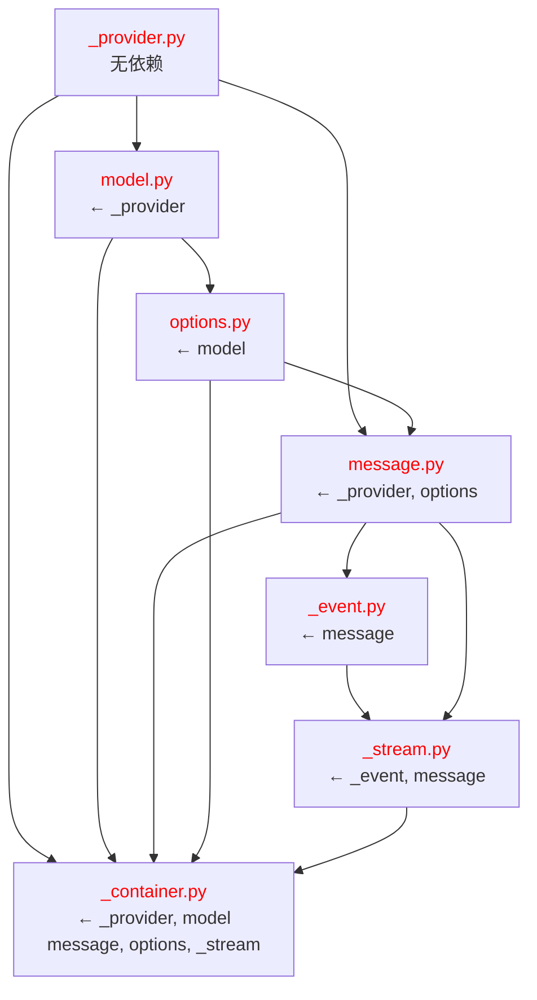

# About

_xxx.py代表常用语内部类型, 不应该直接使用.

## type 架构图

```mermaid
graph TD
    Provider[<font color='red'>_provider.py</font><br>无依赖]
    Model[<font color='red'>model.py</font><br>← _provider]
    Options[<font color='red'>options.py</font><br>← model]
    Message[<font color='red'>message.py</font><br>← _provider, options]
    Event[<font color='red'>_event.py</font><br>← message]
    Stream[<font color='red'>_stream.py</font><br>← _event, message]
    Container[<font color='red'>_container.py</font><br>← _provider, model<br>message, options, _stream]

    Provider --> Model
    Provider --> Message
    Model --> Options
    Options --> Message
    Message --> Event
    Event --> Stream
    Message --> Stream
    Provider --> Container
    Model --> Container
    Message --> Container
    Options --> Container
    Stream --> Container
```